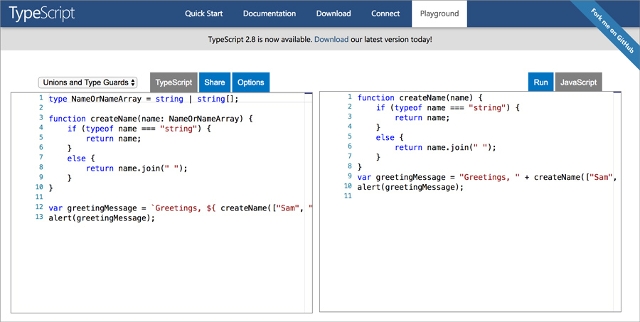

# TypeScript 소개 및 사용법

TypeScript는 2012년에 발표된 오픈 소스 프로그래밍 언어로, 대규모 JavaScript 애플리케이션 개발을 목적으로 Microsoft에 의해 개발되었습니다.

## 특징

### JavaScript 수퍼셋(Superset)

TypeScript는 JavaScript, ECMAScript를 포함하는 수퍼셋[^1]으로 JavaScript, ECMAScript에서 지원하지 않는 기능을 지원합니다.

- 엄격한 타입 관리(Strongly Typed)  - `컴파일 시점에 타입 검사`
- 제너릭(Generics)
- 인터페이스(Interface)
- ...

 

 

### 트랜스파일러(Transpiler)

TypeScript 파일(`*.ts`)은 웹 브라우저에서 바로 해석될 수 없습니다. 브라우저에서 해석 가능한 언어인 JavaScript로 변환해야 브라우저는 이를 인식하고 해석할 수 있습니다. 즉, TypeScript를 JavaScript로 변환해야 사용이 가능합니다. 그래서 TypeScript 컴파일 결과가 JavaScript 언어로 출력되기에 컴파일러(Compiler)[^2]가 아닌, 트렌스파일러(Transpiler)로 불립니다. 그리고 이러한 언어를 메타 언어(Meta Language)[^3]라고 부릅니다.

 

 

## 플레이그라운드(Playground)

가볍고 빠르게 TypeScript를 테스트 해보려면 [TypeScript 플레이그라운드][1]를 통해 TypeScript 코드가 JavaScript 코드로 변환되는 결과를 실시간으로 확인할 수 있습니다.

<!-- 링크 -->
[1]: https://typescriptlang.org/play

 

---

##### 각주

[^1]: "상위 집합" 또는 "전체 집합"을 의미합니다.
[^2]: "변환" 또는 "변경"하는 일을 말합니다.
[^3]: 대상을 직접 서술하는 언어 그 자체를 다시 언급하는 한 차원 높은 언어로 고차언어(高次言語)로도 불립니다.