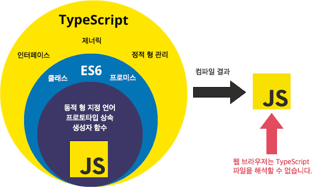

# 소개 및 사용법

TypeScript는 2012년에 발표된 오픈 소스 프로그래밍 언어로, 대규모 JavaScript 애플리케이션 개발을 목적으로 Microsoft에 의해 개발되었습니다.

## 특징

### JavaScript 수퍼셋 {#javascript-superset}

TypeScript는 JavaScript, ECMAScript를 포함하는 수퍼셋\(Superset\)으로 **JavaScript 또는 ECMAScript에서 지원하지 않는 기능을 지원**합니다. TypeScript를 대표로 하는 기능은 다음과 같습니다.

* **엄격한 타입 관리**\(Strongly Typed\) -  [컴파일](cli-env.md#typescript-cli) 시점에 타입 검사 -  [에디터 확장](linting.md#integration) 시, 실시간 타입 검사
* **제너릭**\(Generics\) -  클래스나 함수가 사용될 때 타입 설정
* **인터페이스**\(Interface\) -  타입 검사를 요구
* ...

### 트랜스파일러 {#transpiler}

TypeScript 파일\(`ts`\)은 웹 브라우저에서 바로 해석될 수 없습니다. 브라우저에서 해석 가능한 언어인 JavaScript로 변경되어야 브라우저는 이를 인식하고 해석할 수 있습니다. 즉, **TypeScript를 JavaScript로 변환해야 웹 브라우저가 처리 가능** 합니다.

그래서 TypeScript가 JavaScript로 출력 되기에 컴파일러가 아닌, **트렌스파일러\(Transpiler\)**로 불립니다. 그리고 이러한 언어를 **메타 언어\(Meta Language\)**라고 부릅니다.

## 플레이그라운드 {#playground}

가볍고 빠르게 온라인 상에서 TypeScript를 테스트 해보려면 [TypeScript 플레이그라운드](https://typescriptlang.org/play)를 통해 TypeScript 코드가 JavaScript 코드로 변환되는 결과를 실시간으로 확인할 수 있습니다.

